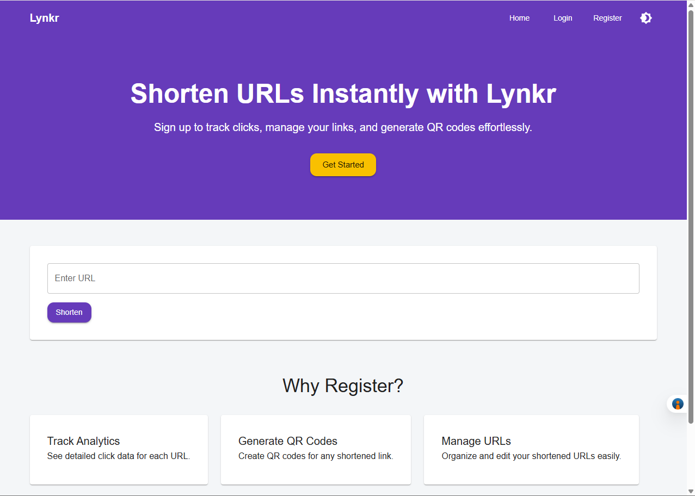

# 🔗 Lynkr - URL Shortener Web App

**Lynkr** is a modern, full-featured **URL Shortener Application** built using **Django**, **React**, and **Supabase**.  
It provides a seamless experience for users to shorten URLs, track analytics, generate QR codes, and manage links — all in one place. 🌐✨  

---

## 🚀 Tech Stack

| Layer | Technology |
|-------|-------------|
| 🧠 Backend | **Python (Django)** |
| 💾 Database | **Supabase (PostgreSQL)** |
| 💻 Frontend | **React + Material UI** |
| 🔐 Authentication | **Supabase Auth + Google Sign-In** |

---

## 🧩 Proposed Module Breakdown

| Module | Description |
|--------|--------------|
| 🔑 **Authentication** | Handles **Signup**, **Login**, **Logout**, and **Google Sign-In**. |
| ✂️ **URL Shortening** | Core logic to **shorten**, **store**, and **redirect** URLs efficiently. |
| 📊 **Analytics** | Tracks and displays **click data**, **usage stats**, and **link insights**. |
| 🧾 **QR Generator** | Creates downloadable **QR codes** for each shortened URL. |
| 🧭 **User Dashboard** | Control panel for users to **manage URLs**, including **update**, **delete**, **activate**, and **deactivate** links. |
| 🛡️ **Admin Panel** | Superuser interface to **monitor** and **manage** all stored data. |
| 🎨 **Frontend UI** | Built with **React + Material UI**, offering a **responsive** and **modern** interface. |

---

## 🧠 Features

✅ Shorten URLs instantly (no login required)  
✅ Sign up or log in using **email** or **Google account**  
✅ **User Dashboard** to **manage**, **update**, **delete**, **activate**, or **deactivate** links  
✅ Track link analytics and traffic stats  
✅ Download **QR codes** for your URLs  
✅ Admin dashboard for monitoring and data control  
✅ Clean, responsive, and modern UI built with Material UI

---

## 🖼️ Screenshots & Demo

Here are some examples of Lynkr’s interface:

### 🌐 Landing Page
  
Quickly shorten URLs and explore features.

### 📊 User Dashboard
  
Manage, update, activate/deactivate, or delete your shortened URLs.

### 📈 Analytics View
  
Track clicks, monitor traffic trends, and gain insights.

### 🧾 QR Generator
  
Generate and download QR codes for any shortened URL.

---

## ⚙️ Setup Instructions

### 1️⃣ Clone the Repository
```bash
git clone https://github.com/dev3010/url-shortner-service.git
cd lynkr

### 2️⃣ Clone the Repository
```bash
cd backend
python -m venv venv
source venv/bin/activate  # or venv\Scripts\activate on Windows
pip install -r requirements.txt
python manage.py migrate
python manage.py runserver

### 3️⃣ Frontend Setup (React)
```bash
cd frontend
npm install
npm start

🧑‍💻 Contributors

👨‍💻 Devesh — Developer & Project Maintainer
